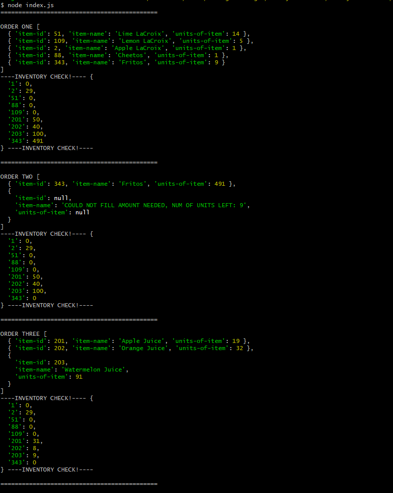

# Steps to use!

1. `npm install` 
    - installs import dependency
2. `cd app`
    - cd's into app
3. `node index.js`
    - runs index.js

### Terminal Output


# What does it have (data)?

There are two "data" files within the data folder: food-data.js and inventory-data.js
These hold sample data in lieu of a true backend

# What does it have (function(s))

Has one function file within the the functions folder: process-order.js

The main function is the first within that file called "processOrder" that takes in an order with item's ids and the number of units needed per that item

The main function returns a processed order list with the desired ordered items and the amount of units to be shipped per item and includes any alternative foods (along with the units per item) if the original food item cannot fill or completely fill the original desired amount.

The main function also updates the inventory data to reflect the ordered amounts

The main functions uses many other functions within the same file for readability, seperation of responsibility, and reducing redundancy since many of these functions are used multiple times.

# index.js

The `index.js` file within the app folder runs our orders. We have three orders to test various scenarious while each new order works off of the updated inventory from the previous order.

1. Adds multiple alternative food items in case of any inventory shortcomings
2. Adds as much inventory as possible in case of inventory shortcomings while stopping an infinite loop and returning an object detailing the number of units still needed
3. Checks to see if a regular order that has no inventory shortcomings, fulfills the order normally

# Data structures used
## Original order
```
[
    {
        "item-id": 1,
        "units-needed": 20
    }
]
```
## Returned order
```
[
    {
        "item-id": 1,
        "item-name": "Cheeto",
        "units-of-item": 20
    }
]
```
## Food data
```
[
    {
        "id": 51,
        "name": "Lime LaCroix",
        "beverage-type": "non-alcoholic",
        "alternative": [109, 1, 2],
        "description": "Sparkling lime flavored water"
    }
]
```
## Inventory
```
[
    1: 20, // "item id": "available inventory in units"
    2: 15
]
```

# Nice-to-haves (extra potential implementations)
1. Run out of alternatives?
    - If, for some reason, all of the alternatives do not have inventory to fill an order, an extra step here would be to simply check if there are other items similar enough to be used as an alternative.
    - For example, if all the alternatives for Lime Lacroix are gone, another fizzy, low calorie, non-alcoholic drink should be good enough as a replacement. Here we could write another function that runs in this case where we filter our food-data to return only drinks that have the types 'fizzy', 'low calorie', and 'non-alcoholic'and then filter through those inventories until that order is filled
    - The reason why I chose not to do that as the default is that Lime and Lemon are similar flavors while Lime and Orange aren't. Therefore, I think it makes sense to have a column of custom/hard-coded alternatives that can always be altered by hand later and using the random "close enough" method as a last option
2. The `process-order.js' file
    - The functions within can be refactored/optimized further depending on preference and/or company standards.
    - Also the functions could have been separated into separate files to reduce the number of lines of code per file, however, since this is small project I decided that having most of the work done in a file would be fine since it still ended up being less than 200 lines of code
